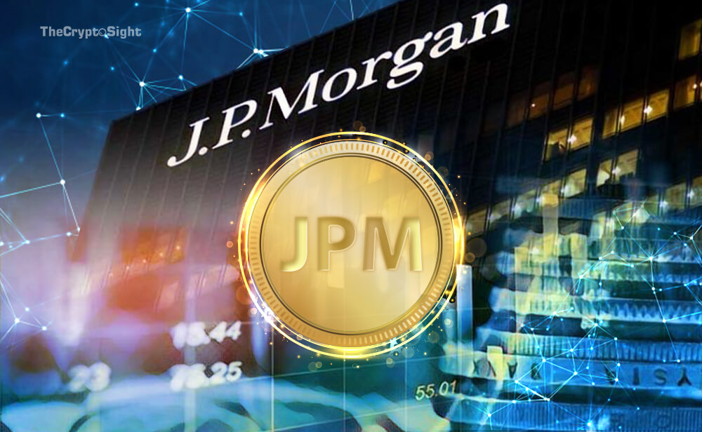

# When a Crypto is Not a Crypto, the JPM Coin

## **Overview and Origin**
### JPMorgan Chase & Co
&nbsp; &nbsp; JPMorgan Chase traces its roots back to 1799 when The Manhattan Company is founded as a water company. It counts among it most notable founders, Aaron Burr and Alexander Hamilton.

&nbsp; &nbsp; The idea came from Aaron Burr in an effort to break the banking monopoly of The Bank of New York and Alexander Hamilton, though the company was initially established to bring clean water to the public. When The Manhattan Company began banking operations, Hamilton severed ties with The Manhattan Company.

&nbsp; &nbsp; [JPMorgan](https://www.jpmorgan.com/global "JPMorgan website") has two main arms, its a commercial bank and an investment bank. The commercial bank generates revenue through deposit taking and lending. The investment bank arm generates revenue by providing advice with mergers and acquisitions, underwriting new issues, trading operations, and revenue from its asset/wealth management business.                                                        

## **Business Activities**

&nbsp; &nbsp; In an effort to improve processes, client experience, timeline, and cost with wholesale payments, the bank developed a new unit dubbed Onyx. Charged with developing products using blockchain, JPM Coin is the first product disclosed to the public. 

&nbsp; &nbsp; The JPM Coin was developed with the initial intent to facilitate payments between it large institutional clients, namely large multinational companies its serves with cross border payment processing. JPMorgan counts most of the largest and prominent multinational companies as its clients. Thus, continuing to innovate and save its clients time and money is paramount to stave off would be poachers. 

&nbsp; &nbsp; The [JPM Coin](https://www.jpmorgan.com/solutions/cib/news/digital-coin-payments "JPM Coin Press Release") is issued on Quorum Blockchain, its in-house Blockchain technology, a permissioned Blockchain using enterprise grade security. Its a Blockchain token tied to the US Dollar; this is also known as a stablecoin. It will ultimately be available on other Blockchain networks.

## **Landscape**

&nbsp; &nbsp; JPMorgan is in Commercial, Retail Banking, and Investment Banking business. Its major competitors are Bank of America, Citicorp, Ripple, and Wells Fargo.

&nbsp; &nbsp; Adoption rates and investment in blockchain and cryptocurrencies have increased in the last 5 to 10 years. Banks such as [Bank of America](https://www.investopedia.com/news/bank-america-applies-blockchainbased-crypto-storage-patent/ "Bank of America has more Blockchain patents than IBM") have applied for a patent for a digital cryptocurrency wallet. BOA is said to have several Blockchain patents, so much so that the Charlotte based bank rivals the likes of IBM. Wells Fargo has developed their internal Blockchain token.

## **Results**
 

&nbsp; &nbsp; Currently the only other major traditional bank with this type of in-house offering is Wells Fargo. The key difference is that the JPM Coin will be "operable on all standard Blockchain networks". This is unlike the [Wells Fargo Digital Cash](https://www.reuters.com/article/us-wells-fargo-blockchain-idUSKBN1W22D3https://www.reuters.com/article/us-wells-fargo-blockchain-idUSKBN1W22D3) token, which is not a client facing product. The other would be competitor is Ripple with its xRapid offering. Ripple's offering uses the XRP cryptocurrency to represent a fiat currency to be used to transfer money. Although Ripple is not a direct competitor now, JPM Coin, if it expands its use case, could compete directly with xRapid. 

## **Recommendations**

&nbsp; &nbsp; Reading between the lines, the JPM Coin is a trial run for a future Blockchain product targeted for wider adoption and further development of Blockchain technologies that could be aimed at its commercial customers, its largest and most profitable arm. 

&nbsp; &nbsp; In order to remain the leader in all things financial services, the company will need to move fast in leveraging the technology to bring to market a product to serve its retail customers. Albeit if it clears all regulatory hurdles. Plans to use the technology to change the way it clears checks are already being explored. If this comes to fruition, it can dramatically change how it processes checks and more importantly, save the company time and cost.

## Sources
1. https://jpmorgan.com
2. https://www.investopedia.com/jpmorgan-to-launch-jpm-coin-4587182
3. https://www.cnbc.com/2020/10/27/jpmorgan-creates-new-unit-for-blockchain-projects-as-it-says-the-technology-is-close-to-making-money.html
4. https://www.coindesk.com/jpmorgans-jpm-coin-is-live-exec-says
5. https://www.fool.com/investing/2017/10/23/how-does-jpmorgan-chase-make-money.aspx
6. https://www.bloomberg.com/news/articles/2019-02-14/jpmorgan-to-use-cryptocurrency-for-payments-business-cnbc-says
7. https://www.forbes.com/sites/francescoppola/2019/02/17/is-jpmcoin-a-serious-threat-to-ripple/
8. https://warriortradingnews.com/2019/06/25/jpm-coin-has-a-timeline-and-it-could-benefit-the-stock-market/
9. https://www.reuters.com/article/us-wells-fargo-blockchain-idUSKBN1W22D3
10. https://www.investopedia.com/news/bank-america-applies-blockchainbased-crypto-storage-patent/
11. https://www.jpmorgan.com/solutions/cib/news/digital-coin-payments